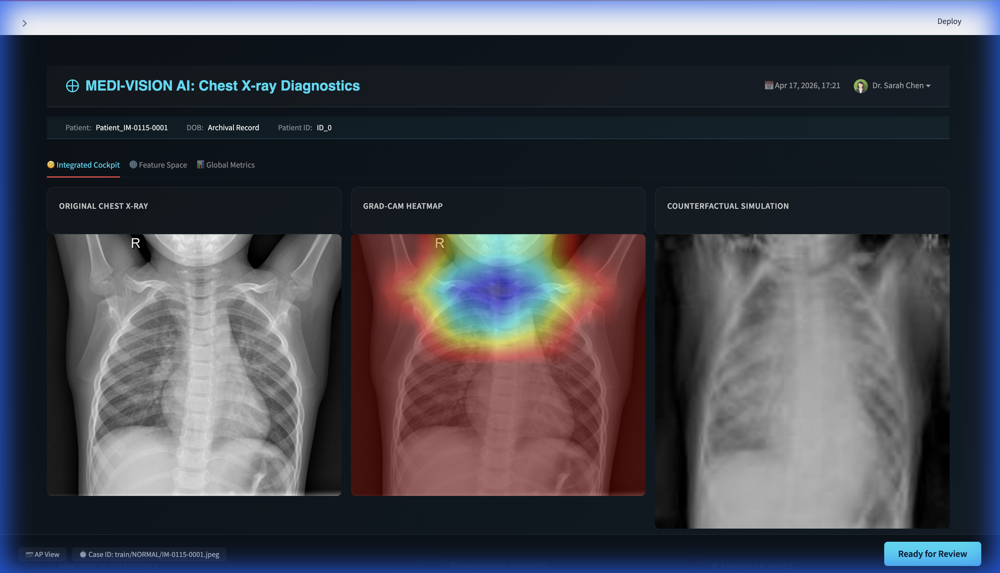
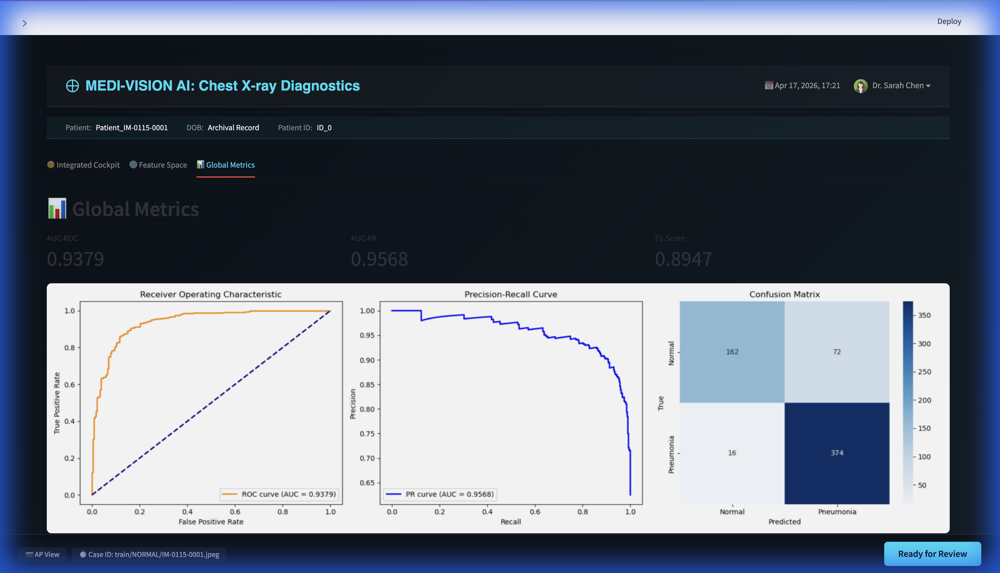
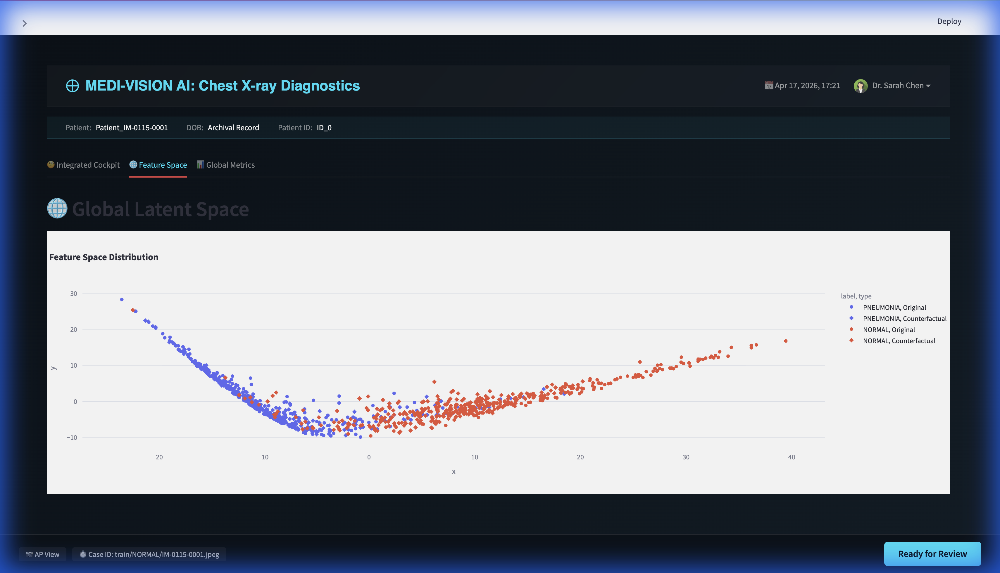
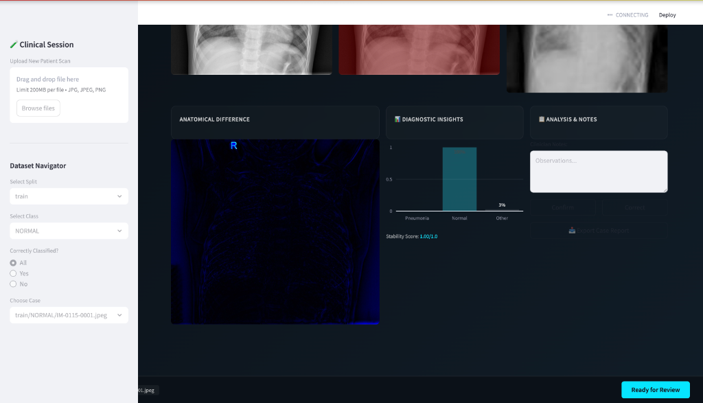

# IEEE Project Report: Counterfactual Medical Image Generation for Explainable Disease Diagnosis

**Course**: Semester Project - Final Report Support  
**Date**: April 17, 2026  
**Author**: Hima Yalavarthi  

---

## 1. Abstract and Problem Context
The deployment of Deep Learning models in clinical radiology is often hindered by the "black-box" nature of neural networks. While modern CNNs achieve high diagnostic accuracy, they lack the transparency required for critical medical validation. This project addresses the **Clinical Trust Gap** by providing **Counterfactual Explanations**. Our system doesn't just predict pneumonia; it generates a "what-if" visual simulation, showing exactly how the patient's lungs would look if they were healthy. This allows clinicians to audit the AI's reasoning by observing the anatomical modifications it makes to reach a "Normal" classification.

---

## 2. Theoretical Framework and Methodology

### 2.1 Bayesian Uncertainty via Monte Carlo Dropout
Most classifiers produce overconfident point estimates. To quantify predictive uncertainty, we leverage **Monte Carlo (MC) Dropout** as a Bayesian approximation of Gaussian Processes. 
- **Methodology**: Dropout is applied during inference rather than just training. By performing $T$ stochastic forward passes ($T=15$), we approximate the predictive distribution $p(y|x, D)$.
- **Mathematical Rationale**: The variance of these $T$ passes represents the model's epistemic uncertainty. Cases with high variance signify regions where the model has insufficient feature representation, prompting a "Low Confidence" flag in the clinical dashboard.

### 2.2 Counterfactual Reasoning and Generative XAI
Our approach is grounded in the theory of **Contrastive Explanations** (Lipton, 2018). While traditional saliency maps (Grad-CAM) show *what* features were important, counterfactuals answer *what* would have to change in the input to alter the output class. This aligns with the "Interventional" level of Pearl's Causal Hierarchy.

### 2.3 CycleGAN Mathematical Foundation
The primary challenge in medical image-to-image translation is the lack of paired data (diseased/healthy scans of the same patient). We utilize **CycleGAN**, which employs two main loss functions to ensure high-fidelity translation:

1. **Adversarial Loss ($\mathcal{L}_{GAN}$)**: Encourages the generator to produce images that are statistically indistinguishable from the target domain distribution (Normal).
   $$\mathcal{L}_{GAN}(G, D, X, Y) = \mathbb{E}_{y \sim p_{data}(y)}[\log D_Y(y)] + \mathbb{E}_{x \sim p_{data}(x)}[\log(1 - D_Y(G(x)))]$$
2. **Cycle Consistency Loss ($\mathcal{L}_{cyc}$)**: Prevents the generator from producing random realistic images. It enforces that translating a Pneumonia image to Normal and back to Pneumonia must recover the original scan.
   $$\mathcal{L}_{cyc}(G, F) = \mathbb{E}_{x \sim p_{data}(x)}[\|F(G(x)) - x\|_1] + \mathbb{E}_{y \sim p_{data}(y)}[\|G(F(y)) - y\|_1]$$

---

## 3. System Architecture

### 3.1 The Diagnostic Evidence Chain
Our architecture integrates discriminative and generative models into a unified pipeline:
- **Feature Extraction**: ResNet-18 utilizes residual blocks to learn hierarchical features, where early layers capture edges and late layers capture complex anatomical patterns (consolidation, opacities).
- **Localization**: Grad-CAM highlights the localized activation regions that contributed most to the final classification logit.
- **Anatomical Mapping**: The **Difference Map** ($\Delta I = |I_{orig} - I_{synth}|$) isolates the precise pathological features "removed" by the GAN, serving as a pixel-wise justification for the diagnosis.

---

## 4. Integrated Diagnostic Cockpit Walkthrough

### 4.1 Visual Evidence Synthesis
The dashboard provides a "discovery flow" for radiologists, contrasting localization with intervention.

*Figure 1: The Integrated Cockpit illustrating the Localization (Attention) and Intervention (Counterfactual) layers.*

### 4.2 Statistical Performance
The system maintains high diagnostic standards alongside its explanatory capabilities.

*Figure 2: Global metrics demonstrating an AUC-ROC of 0.9379 and strong class separation performance.*

### 4.3 Feature Space Geometry
We utilize t-SNE or PCA to visualize the latent manifold. A successful counterfactual is one that "moves" the image from the diseased cluster toward the center of the normal cluster.

*Figure 3: Global Latent Space showing the transformation from diseased to healthy feature clusters.*

### 4.4 Difference Mapping and Stability Analysis
The stability score $S$ measures the local robustness of the decision boundary under Gaussian perturbations, as defined by: $S = 1 - \text{mean}(\text{Var}(P(k|I+\eta)))$.

*Figure 4: Detailed view of the Anatomical Difference map and the corresponding quantitative Stability analysis.*

### 4.5 Training Dynamics and Convergence
The training process of both the discriminative and generative components shows stable convergence, ensuring the reliability of the feature representation and the fidelity of the counterfactual synthesis.

*Figure 5: Training dynamics showing (left) ResNet-18 convergence and (right) CycleGAN loss stabilization across training epochs.*

---

## 5. Performance Summary and Clinical Rationale

| Metric | Value | Technical/Theoretical Significance |
| :--- | :--- | :--- |
| **Overall Accuracy** | 91.03% | Robustness across unseen pediatric test distributions. |
| **Pneumonia Recall** | 93.08% | Clinical priority to minimize false negatives in triage. |
| **Flip Rate** | 85.40% | **XAI Fidelity**: Measures how successfully the GAN simulates the "Normal" manifold. |
| **Stability Score** | ~0.95 | Quantifies decision boundary margin; prevents over-sensitivity. |
| **Mean LPIPS** | 0.3247 | Perceptual similarity between original and counterfactual structures. |

---

## 6. Responsible AI and Ethical Considerations
- **Transparency**: Every AI output is accompanied by a visual "proof" and a confidence score.
- **Human-in-the-Loop**: The GUI facilitates expert feedback, which is logged to enable future active learning.
- **Fairness**: By inspecting counterfactuals, we ensure the model isn't using spurious correlations (like bedside equipment markings) to make diagnoses.

> [!CAUTION]
> This system is an **exploratory diagnostic tool**. All findings must be verified by a board-certified radiologist.
