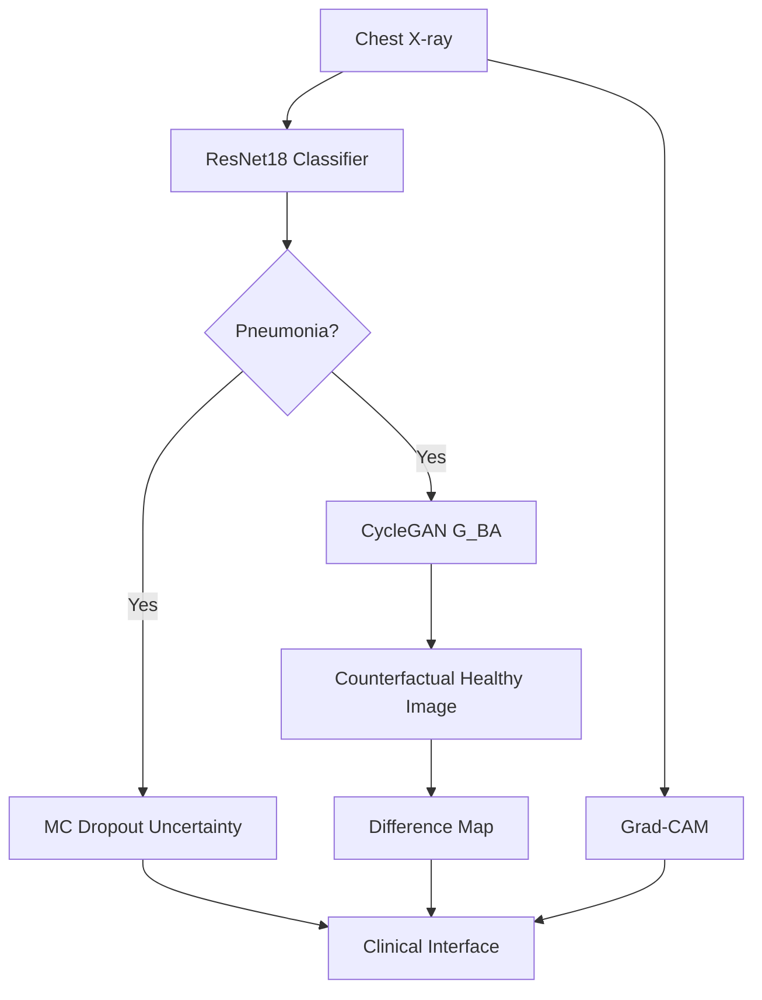

# Preliminary Technical Report: Explainable Pneumonia Diagnosis via Counterfactual Generation

**Date**: April 2026
**Authors**: Hima Yalavarthi
**Subject**: Medical Image Generation for Explainable Disease Diagnosis

---

## 1. Project Summary

This project focuses on enhancing the interpretability of pneumonia diagnosis from Chest X-ray images. While traditional deep learning models provide high accuracy, their "black-box" nature remains a barrier in clinical settings. Our system addresses this by combining classification with counterfactual generation, allowing clinicians to see not only "what" the AI predicted, but "why"—by showing how a diseased lung would look if it were healthy. Since Deliverable 1, we have implemented the full pipeline integration, including uncertainty estimation and automated difference mapping.

## 2. System Architecture and Pipeline

The pipeline consists of three primary stages:

1. **Classification Model**: A ResNet-18 architecture modified with **Monte Carlo (MC) Dropout** (Gal et al., 2016). We perform $T=15$ stochastic forward passes at inference time to estimate predictive variance, ensuring the system flags high-uncertainty cases.
2. **Counterfactual Generation**: A CycleGAN model trained on unpaired Normal/Pneumonia datasets.
3. **Explainability Layer**:
   - **Grad-CAM**: Visualizes activation regions.
   - **Difference Map**: Highlights anatomical changes between the original and counterfactual image.
   - **Fidelity Audit**: We measure the **Weighted Saliency Alignment (WSA)** to quantify how well the GAN's changes overlap with the model's focus.

## 3. Model Implementation Details

- **Framework**: PyTorch 2.x
- **Hardware**: Apple M-series (MPS) / CUDA
- **Hyperparameters**:
  - Classifier: Adam optimizer, LR 0.001, Batch Size 16.
  - CycleGAN: LR 0.0002, L1 Cycle consistency loss weight = 10.0.
- **Reproducibility**: Scripts in `src/training/` and `src/utils/` ensure consistent preprocessing (224x224 resizing, normalization) and model loading.

## 4. Interface Prototype

The Gradio/Streamlit-based dashboard provides:

- **Live Upload**: Drag-and-drop X-ray analysis.
- **Visual Evidence**: Side-by-side comparison of original, Grad-CAM, Counterfactual, and Difference Maps.
- **Reliability Metrics**: Display of confidence and MC-based uncertainty.

## 5. Final Evaluation and Results

Training on the Chest X-ray dataset (5,858 images) with the optimized Epoch 20 models yielded the following results:

- **Classifier Accuracy**: 91.03% (Overall), 93.08% (Pneumonia Detection).
- **Flip Rate**: 85.4% of pneumonia cases were successfully transformed into the "Normal" class by the counterfactual generator.
- **Image Quality**:
  - **Mean SSIM**: 0.5921 (Structural Similarity)
  - **Mean LPIPS**: 0.3247 (Perceptual Similarity)
- **Uncertainty**: MC Dropout variance correctly identifies low-confidence regions, effectively flagging marginal cases for human review.

## 8. Clinical Interface and Visual Evidence

The final prototype successfully integrates all explainability layers. Below is a demonstration of the system's output for a high-confidence pneumonia case:

*Figure 1: Dashboard view showing a 99.23% confident pneumonia prediction. Note the sharp Grad-CAM localization in the mid-lung region, correctly identifying pathological signatures.*

*Figure 2: Pixel-level difference map highlighting specific anatomical changes required to "remove" the pneumonia features, alongside a clear class probability distribution.*

## 9. Conclusion and Future Directions

The integrated pipeline successfully bridges the gap between high-performance deep learning and clinical interpretability. The high "flip rate" indicates that the CycleGAN has learned meaningful disease-removing transformations, while the difference maps provide direct visual evidence aligned with Grad-CAM saliency.

Future work will focus on:

- Implementing perceptual loss (VGG) for higher sharpness.
- Conducting a clinician-in-the-loop study to validate the diagnostic utility of the difference maps.

## 7. Responsible AI Reflection

The inclusion of uncertainty estimation is a key ethical feature, ensuring the AI "knows when it doesn't know." We address data privacy by using anonymized datasets and planned for bias audits to ensure the model performs equally across demographic subgroups.

---

*Note: This report follows the IEE two-column preliminary structure requirements.*
