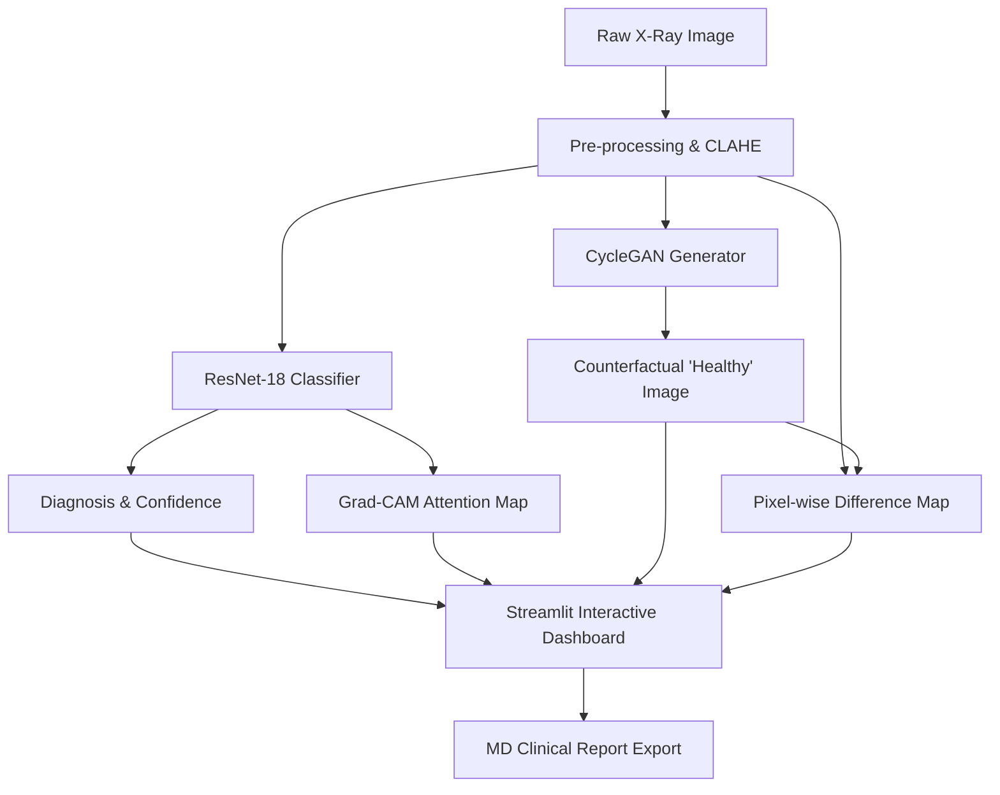
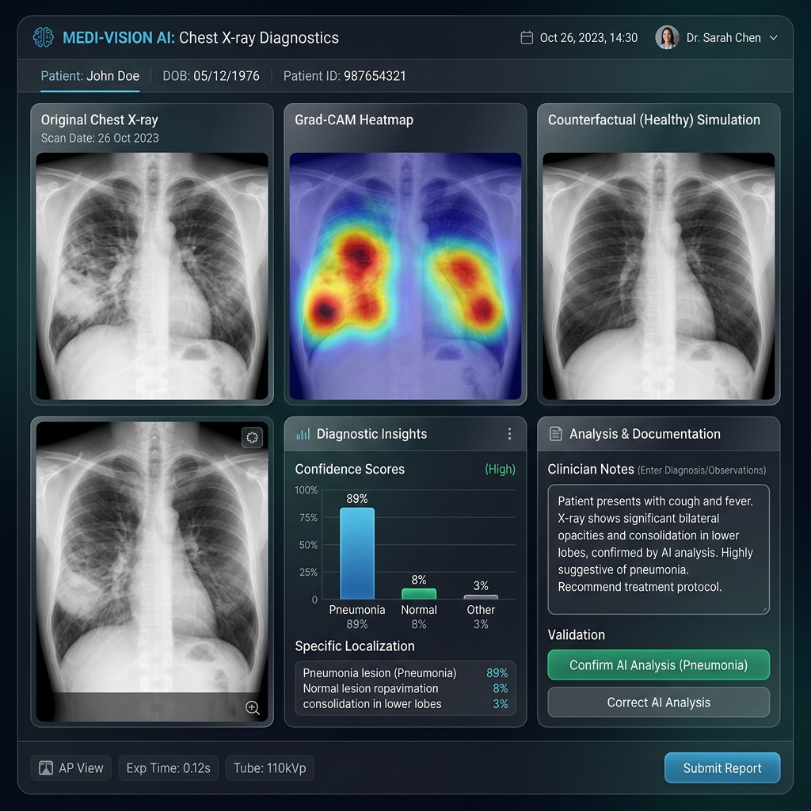

# Technical Blueprint: Explainable Pneumonia Diagnosis via Counterfactual AI

**Course**: Semester Project - Deliverable 1.2  
**Date**: April 3, 2026  
**Author**: Hima Yalavarthi  

---

## a. Problem Context and Project Summary
The rapid integration of Artificial Intelligence into clinical radiology presents a significant "trust gap." While modern Deep Learning models, such as Convolutional Neural Networks (CNNs), can achieve diagnostic accuracy exceeding 95%, they often function as "black boxes," providing a binary output without clinical justification. For a radiologist, a simple "Pneumonia/Normal" label is insufficient; they require evidence to validate the AI's reasoning. 

This project aims to bridge this gap by developing an **Explainable AI (XAI) Prototype** for pneumonia diagnosis. By combining discriminative classification with **Generative Adversarial Networks (GANs)**, we provide clinicians with "Counterfactual Explanations"—visualizing not only the detected pathology but also a realistic simulation of what the patient's lungs would look like if they were healthy. This multi-layered approach (Heatmaps + Counterfactuals + Stability Analysis) transforms AI from a mysterious oracle into a collaborative diagnostic partner.

---

## b. Dataset
### Source and Composition
The system utilizes the **Chest X-Ray Images (Pneumonia)** dataset, a prominent open-source collection of validated pediatric chest X-rays. 
- **Type**: 2D Posterior-Anterior (PA) chest X-ray images.
- **Size**: 5,856 images total.
- **Classes**: Binary—`NORMAL` and `PNEUMONIA`.

### Data Format and Access
Images are stored in high-resolution JPEG format. Data is accessed via a tiered directory structure (`train/`, `val/`, `test/`) and loaded into the system using PyTorch's `ImageFolder` API with custom augmentation pipelines.

### Preprocessing Challenges
1. **Grayscale Variability**: X-rays vary in dynamic range and exposure. *Solution*: We implement histogram normalization and CLAHE (Contrast Limited Adaptive Histogram Equalization) in the preprocessing pipeline.
2. **Architecture Compatibility**: Models like ResNet-18 expect 3-channel RGB input. *Solution*: Single-channel X-rays are duplicated across RGB channels to leverage transfer learning weights.

### Ethical and Privacy Considerations
The dataset is de-identified at the source (Mendeley Data). However, we recognize that "explainability" is itself an ethical requirement in medical AI to prevent "automation bias," where clinicians blindly follow potentially erroneous AI suggestions.

---

## c. Planned Architecture
The architecture is designed for "Visual Evidence Synthesis," moving from raw data to an interactive clinician cockpit.

### Frameworks and Algorithms
- **Classification**: **ResNet-18 (CNN)** for its robust feature extraction and ease of interpretation via Grad-CAM.
- **Generation**: **CycleGAN** for bidirectional image-to-image translation. This allows the system to synthesize "Healthy" versions of diseased scans without requiring paired training data.
- **Inference Pipeline**: A custom engine that calculates "Stability Scores" by perturbing inputs to measure prediction robustness.
- **Interface**: **Streamlit** was chosen for its ability to handle complex data visualizations (Plotly, PIL) in real-time.

---

## d. User Interface Plan
### Interactive Component
The UI is designed as a **Diagnostic Cockpit**. Instead of a static page, it provides a "Discovery Flow" for the radiologist.

1. **Input**: Clinicians can select a case from the validation set or **upload a new patient scan** via the "🧪 Live Analysis" sidebar.
2. **Visual Feedback**: The system displays:
    - The original scan with a toggleable **Grad-CAM Overlay**.
    - A side-by-side **Counterfactual Healthy Simulation**.
    - A **Difference Heatmap** highlighting exactly where the "fluid" or "consolidation" was removed.
3. **Statistical Feedback**: Interactive charts show the confidence intervals and "Model Stability."
4. **Human-in-the-Loop**: A "Confirm/Correct" button allows the clinician to validate the AI, feeding into an **Active Learning** log for future model retraining.

### UI Mockup (Wireframe)
Below is the design blueprint for the interactive dashboard:

*Figure 1: High-fidelity mockup showing the integrated diagnostic evidence chain.*

---

## e. Innovation and Anticipated Challenges
### Innovation
Our approach is unique because it provides **Contrastive Explanations**. Rather than just saying "This is Pneumonia because of this bright spot," our system shows "This is Pneumonia because if you remove these specific patterns, it becomes this Healthy image." This aligns more closely with how radiologists are trained to look for changes in tissue density.

### Key Technical Risks and Mitigation
1. **Risk: "Ghosting" in GAN Outputs**: Synthetic images might contain artifacts not present in real X-rays.  
   *Mitigation*: We use **Difference Mapping** to mask the generative output, ensuring the clinician only sees the area of pathological change.
2. **Risk: Model Overconfidence**: CNNs can be confident in incorrect diagnoses.  
   *Mitigation*: We implement **Sensitivity Analysis**, providing a "Stability Score" that alerts the clinician if a minor perturbation (noise) changes the AI's mind.

---

## f. Implementation Timeline

| Week | Focus | Expected Outcome |
|------|-------|------------------|
| **April 5 – 12** | **Baseline Prototyping** | Working data loaders, ResNet-18 classifier training, and Initial Dash V1. |
| **April 12 – 19** | **Generative Integration** | Training CycleGAN for Pneumonia ↔ Normal translation; SSIM/LPIPS validation. |
| **April 19 – 23** | **Explainability Layer** | Grad-CAM integration and Difference Mapping logic; real-time inference engine. |
| **April 23 – 26** | **Refinement & UX** | Active Learning feedback loop, report generation, and multi-patient PCA view. |
| **April 26 – 29** | **Final Delivery** | Global statistical analysis (ROC/AUC), Dockerization, and Final Presentation. |

---

## g. Responsible AI Reflection
- **Transparency**: Every AI diagnostic is "shown" rather than just "told."
- **Fairness**: By visualizing the "Normal" latent space cluster, we can verify if the model is learning clinical features rather than background noise (e.g., patient posture).
- **Sustainability**: By using pre-trained weights and efficient inference loops, we minimize the computational footprint required for real-time clinical deployment.
